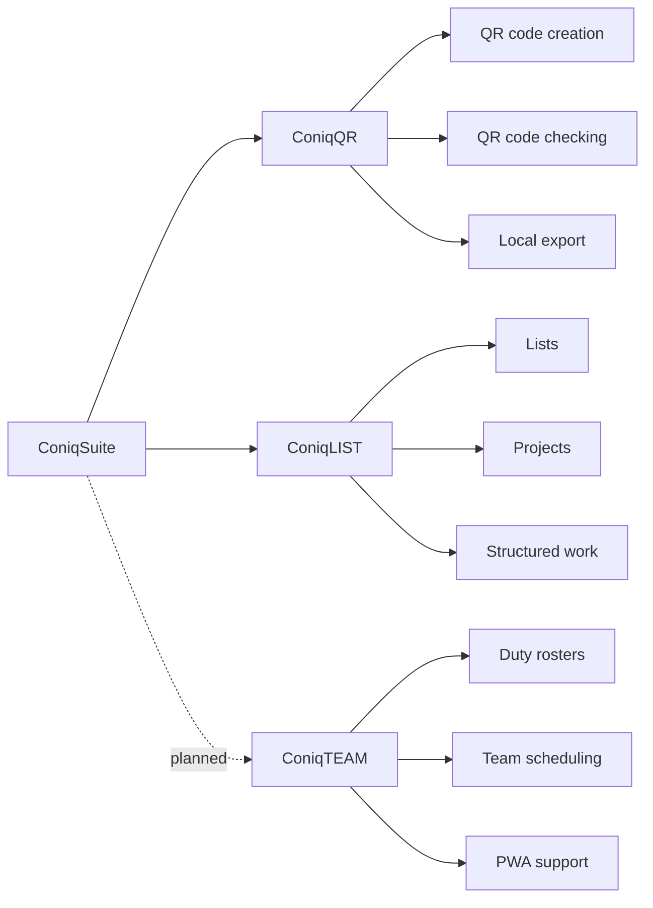
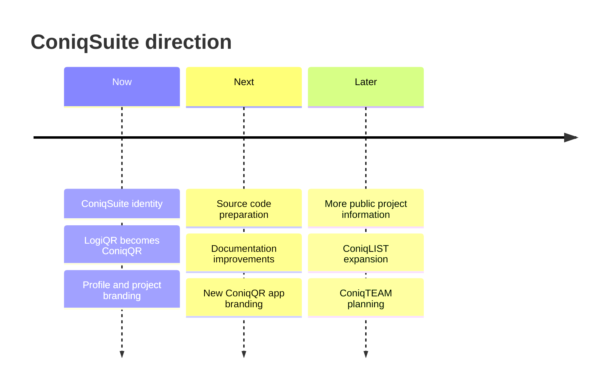

  

  
  
  

  
  
  
  

  <strong>ConiqSuite builds practical software for everyday digital work.</strong> 
  Simple tools. Clear workflows. Transparent where trust matters.

---

## ✦ What is ConiqSuite?

**ConiqSuite** is a growing software project focused on building useful, accessible tools for organization, digital workflows, and everyday productivity.

The project was founded and is currently developed by **Connor Christ**.  
At this stage, ConiqSuite is not a company or a large team — it is an independent project with a professional direction and a clear goal:

> **Make helpful software more accessible without hiding the important parts users should be able to trust.**

ConiqSuite is **not fully open source**. Some parts may remain closed source for security, structure, or long-term maintainability.  
However, important checking, validation, and verification-related processes are planned to be made transparent where it makes sense.

---

## ⚡ The ConiqSuite idea

<table>
  <tr>
    <td width="33%" align="center">
      <h3>🧩 Useful</h3>
      
Tools should solve real problems, not create new ones.

    </td>
    <td width="33%" align="center">
      <h3>🔍 Transparent</h3>
      
Critical checking processes should be understandable and trustworthy.

    </td>
    <td width="33%" align="center">
      <h3>🚀 Accessible</h3>
      
Software should be available to more people, not only behind complex paywalls.

    </td>
  </tr>
</table>

---

## 🧭 Project overview

---

## 🛠️ Projects

<table>
  <tr>
    <th align="left">Project</th>
    <th align="left">Status</th>
    <th align="left">Purpose</th>
  </tr>
  <tr>
    <td>
      <strong>ConiqQR</strong> 
      formerly LogiQR
    </td>
    <td>
      
    </td>
    <td>
      A local desktop app for creating, checking, and exporting QR codes.
    </td>
  </tr>
  <tr>
    <td>
      <strong>ConiqLIST</strong>
    </td>
    <td>
      
    </td>
    <td>
      A flexible tool for lists, project organization, structured tasks, and organized information.
    </td>
  </tr>
  <tr>
    <td>
      <strong>ConiqTEAM</strong>
    </td>
    <td>
      
    </td>
    <td>
      A planned duty roster and team scheduling web app with PWA support.
    </td>
  </tr>
</table>

---

## 🔷 ConiqQR

**ConiqQR** is the new name for **LogiQR**.

It is designed for users who need a simple and reliable way to work with QR codes locally — without depending on online services for every step.

**Focus areas:**

- QR code creation
- QR code checking
- export options
- local-first usage
- clear and simple usability

> The transition from **LogiQR** to **ConiqQR** is currently in progress.  
> The new name and logo will appear in the next version of the app.

  

---

## 🟣 ConiqLIST

**ConiqLIST** is a flexible list and project organization tool.

It is not limited to inventory lists. The goal is to support structured work with lists, projects, tasks, notes, and organized digital records.

**Possible use cases:**

- project lists
- task planning
- structured notes
- simple workflows
- organized information

---

## 🟠 ConiqTEAM

**ConiqTEAM** is planned as a scheduling and team coordination web application with PWA support.

The idea is to provide a practical tool for duty rosters, shift planning, and team-based scheduling that can run in the browser and be installed like an app where supported.

**Planned direction:**

- duty roster planning
- team schedules
- browser-based access
- PWA support
- simple team organization

---

## 🔐 Source code and transparency

ConiqSuite is built with a balanced source model.

<table>
  <tr>
    <td width="50%">
      <h3>Closed where needed</h3>
      
Some parts may remain closed source for security, structure, or maintainability.

    </td>
    <td width="50%">
      <h3>Open where trust matters</h3>
      
Important checking and validation-related processes are planned to be made transparent.

    </td>
  </tr>
</table>

The source code for ConiqSuite projects is planned to be published step by step in the future.  
Until then, public repositories, documentation, and project information will be expanded over time.

---

## ✨ Naming style

ConiqSuite uses a consistent naming style across its projects:

| Name | Meaning |
|---|---|
| **ConiqSuite** | The main organization and project identity |
| **ConiqQR** | QR code creation, checking, and export |
| **ConiqLIST** | Lists, projects, and structured organization |
| **ConiqTEAM** | Planned scheduling and team coordination |

---

## 🧱 Current direction

---

## 📌 Quick links

  
  
  

---

  <strong>ConiqSuite</strong> 
  Accessible software. Transparent checks. Built with purpose.

  

