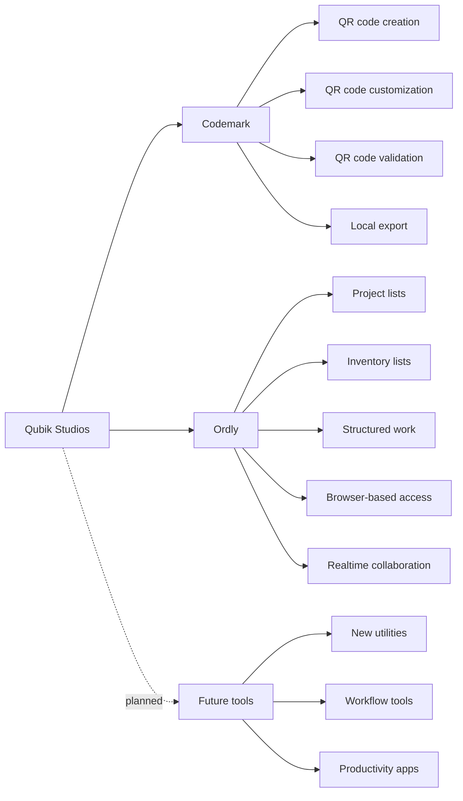
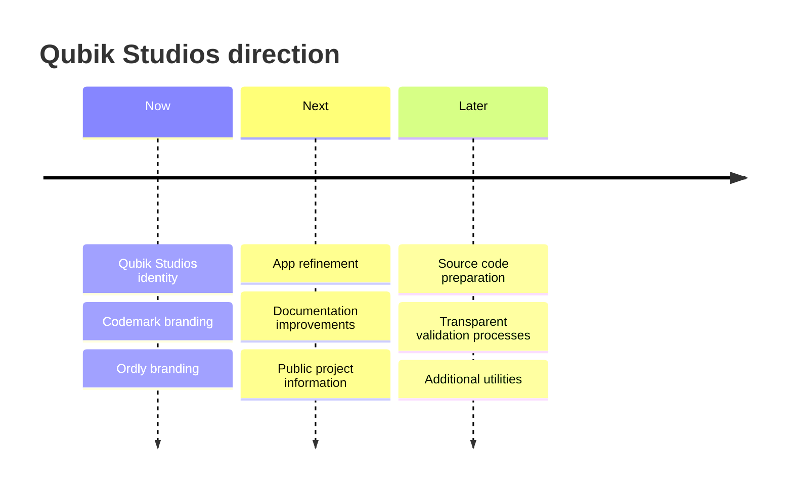

  

  
  
  

  
  
  
  
  
  

  <strong>Qubik Studios builds practical software for everyday digital work.</strong> 
  Local-first desktop tools. Browser-based workflows. Clear and purposeful software.

---

## ✦ What is Qubik Studios?

**Qubik Studios** is an independent software project focused on building practical tools for productivity, organization, and digital workflows.

The project was founded and is currently developed by **Connor Christ**.

At this stage, Qubik Studios is not a large company or agency. It is an independent software studio with a professional direction and a clear goal:

> **Create useful software that stays understandable, accessible, and reliable.**

Qubik Studios is **not fully open source**. Some parts may remain closed source for security, structure, or long-term maintainability.

However, important checking, validation, and verification-related processes are planned to be made transparent where it makes sense.

---

## ⚡ The Qubik Studios idea

<table>
  <tr>
    <td width="33%" align="center">
      <h3>🧩 Practical</h3>
      
Tools should solve real problems without adding unnecessary complexity.

    </td>
    <td width="33%" align="center">
      <h3>💻 Platform-aware</h3>
      
Some tools work best as desktop apps, while others are better as browser-based workflows.

    </td>
    <td width="33%" align="center">
      <h3>🔍 Transparent</h3>
      
Critical checking processes should be understandable and trustworthy.

    </td>
  </tr>
</table>

---

## 🧭 Project overview

---

## 🛠️ Projects

<table>
  <tr>
    <th align="left">Product</th>
    <th align="left">Type</th>
    <th align="left">Status</th>
    <th align="left">Purpose</th>
  </tr>
  <tr>
    <td>
      <strong>Codemark</strong> 
      QR code tool
    </td>
    <td>
      Desktop app
    </td>
    <td>
      
    </td>
    <td>
      A local desktop app for creating, customizing, validating, and exporting QR codes.
    </td>
  </tr>
  <tr>
    <td>
      <strong>Ordly</strong> 
      List and project organization tool
    </td>
    <td>
      Browser-based app
    </td>
    <td>
      
    </td>
    <td>
      A flexible browser-based tool for project lists, inventory lists, structured tasks, and organized information.
    </td>
  </tr>
  <tr>
    <td>
      <strong>Future tools</strong>
    </td>
    <td>
      To be defined
    </td>
    <td>
      
    </td>
    <td>
      Additional utilities may be added under the Qubik Studios umbrella over time.
    </td>
  </tr>
</table>

---

## 🔷 Codemark

**Codemark** is a desktop app by **Qubik Studios**.

It is designed for users who need a simple and reliable way to create, customize, validate, and export QR codes locally.

Codemark is not a scanner app and does not focus on document scanning. Its focus is the creation and export of QR codes for practical everyday use.

**Focus areas:**

- QR code creation
- QR code customization
- QR code validation
- local export
- local-first usage
- clear and simple usability

  

---

## 🟣 Ordly

**Ordly** is a browser-based app by **Qubik Studios**.

It is a flexible list and project organization tool that runs in the browser. It is not limited to inventory lists. The goal is to support structured work with projects, tasks, equipment lists, notes, and organized digital records.

Ordly is designed for browser-based access and can be extended toward realtime collaboration, shared project views, and PWA-style usage where supported.

**Possible use cases:**

- project lists
- inventory lists
- equipment lists
- task planning
- structured notes
- simple workflows
- organized information
- collaborative list work
- browser-based project organization

  

---

## 🔐 Source code and transparency

Qubik Studios is built with a balanced source model.

<table>
  <tr>
    <td width="50%">
      <h3>Closed where needed</h3>
      
Some parts may remain closed source for security, structure, or maintainability.

    </td>
    <td width="50%">
      <h3>Open where trust matters</h3>
      
Important checking and validation-related processes are planned to be made transparent.

    </td>
  </tr>
</table>

The source code for Qubik Studios projects is planned to be published step by step in the future.

Until then, public repositories, documentation, and project information will be expanded over time.

---

## ✨ Naming style

Qubik Studios uses a product-based naming structure.

| Name | Meaning |
|---|---|
| **Qubik Studios** | Main project identity and publisher brand |
| **Codemark** | QR code creation, customization, validation, and export |
| **Ordly** | Browser-based lists, projects, inventory, and structured organization |
| **Future tools** | Additional utilities under the Qubik Studios umbrella |

This structure keeps the product names clear and independent while keeping the overall project identity consistent.

---

## 🧱 Current direction

---

## 📌 Quick links

  
  
  

> Some public links may still use legacy domains while the new branding is being prepared.

---

  

